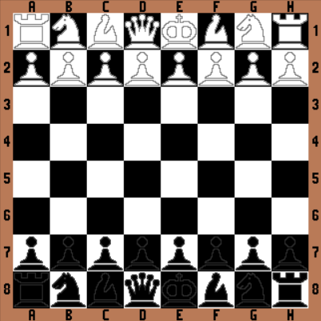

# Chess Game in Python

This Python program implements a chess game with a graphical user interface created using the Tkinter library.

## Features
- Chess game implementation in Python.
- Graphical user interface built with Tkinter.
- Two-player mode for local matches.
- Standard chess rules applied.

## Requirements
Make sure you have Python installed. The program is compatible with Python 3.

